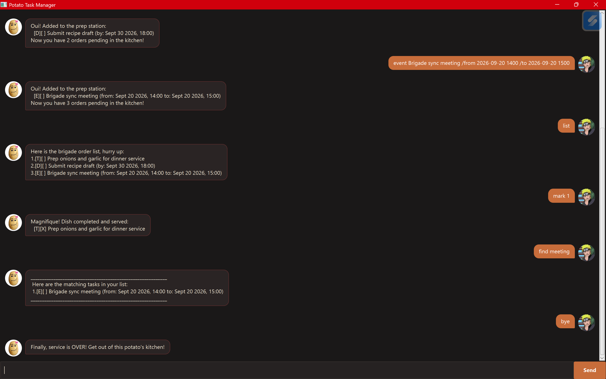

# Potato User Guide



**Potato** is a desktop task manager with a fiery French chef, Chef Patate, running the kitchen. Tell Chef Patate what's on your plate — todos, deadlines, or events — and he'll keep the order board in shape (loudly).

Potato is optimised for **typing commands** — if you're a fast typist, Potato can manage your tasks faster than a mouse-driven app.

## Quick Start

1. Ensure you have **Java 17** or above installed on your computer.
2. Download the latest `potato.jar` from the [releases page](../../releases).
3. Copy the file to the folder you want to use as the home folder for Potato.
4. Open a terminal in that folder and run:
   ```
   java -jar potato.jar
   ```
   A window should appear with Chef Patate ready to take your orders.
5. Type a command into the text box at the bottom and press **Enter** (or click **Send**) to try it. Some examples:

    * `list` — shows all your tasks
    * `todo borrow book` — adds a todo task
    * `deadline return book /by 2026-06-15` — adds a task with a deadline
    * `delete 3` — deletes the 3rd task in the list
    * `bye` — exits the app

6. Refer to [Features](#features) below for details of each command.

## Features

> **Notes on the command format**
> * Words in `UPPER_CASE` are parameters you supply, e.g. in `todo DESCRIPTION`, `DESCRIPTION` is the task description.
> * Task numbers (`INDEX`) refer to the position shown by the `list` command, starting from 1.
> * Dates can be entered as `yyyy-MM-dd` (e.g. `2026-06-15`), or with a time as `yyyy-MM-dd HHmm` / `yyyy-MM-dd HH:mm` (e.g. `2026-06-15 1800` or `2026-06-15 18:00`) for a more precise deadline or event time. Any other format is kept and displayed exactly as typed.

### How dates are parsed and displayed

If you type a date/time in one of the recognised formats above, Potato understands it as a real date and reformats it into a friendlier, human-readable style whenever the task is shown (in `list`, `find`, or right after adding it). If you type anything else, Potato can't be sure what it means, so it just stores and displays your text exactly as you typed it — nothing is lost, it just won't be "understood" as a date.

| You type | Potato recognises it as | Displayed as |
|---|---|---|
| `2026-06-15` | a date | `Jun 15 2026` |
| `2026-09-15` | a date | `Sept 15 2026` |
| `2026-06-15 1800` | a date and time | `Jun 15 2026, 18:00` |
| `2026-06-15 18:00` | a date and time | `Jun 15 2026, 18:00` |
| `next monday` | plain text (unrecognised) | `next monday` |

This applies to both `/by` (for `deadline`) and `/from` / `/to` (for `event`) — each date is parsed independently, so an event can even mix a recognised date for `/from` with plain text for `/to` if you're not sure of the exact date yet.

> **Note:** Most months are shown with a 3-letter abbreviation (`Jun`, `Jul`, `Aug`, `Oct`...), but September is shown as `Sept` (4 letters). This isn't a typo — it's how Java's date formatting library abbreviates that month by default.

### Adding a todo: `todo`

Adds a simple task with no date attached.

Format: `todo DESCRIPTION`

Example:
```
todo borrow book
```

### Adding a deadline: `deadline`

Adds a task that needs to be done by a specific date (and optionally time).

Format: `deadline DESCRIPTION /by DATE`

Example:
```
deadline return book /by 2026-06-15
deadline submit report /by 2026-06-15 1800
```

### Adding an event: `event`

Adds a task that starts and ends at specific dates/times.

Format: `event DESCRIPTION /from START /to END`

Example:
```
event team dinner /from 2026-06-15 /to 2026-06-16
event project meeting /from 2026-06-15 1400 /to 2026-06-15 1600
```

### Listing all tasks: `list`

Shows every task currently on the board, in the order they were added (or last sorted).

Format: `list`

### Finding tasks: `find`

Searches for tasks whose description contains the given keyword. The search is case-insensitive.

Format: `find KEYWORD`

Example:
```
find book
```

### Marking a task as done: `mark`

Marks the task at the given index as completed.

Format: `mark INDEX`

Example:
```
mark 2
```

### Unmarking a task: `unmark`

Marks the task at the given index as not completed.

Format: `unmark INDEX`

Example:
```
unmark 2
```

### Deleting a task: `delete`

Removes the task at the given index from the list.

Format: `delete INDEX`

Example:
```
delete 3
```

### Sorting tasks: `sort`

Sorts all tasks alphabetically by their description (A–Z, not case-sensitive).

Format: `sort`

### Exiting the program: `bye`

Says goodbye and closes the app.

Format: `bye`

### Saving the data

Potato automatically saves your tasks to disk after every command that changes the list (adding, deleting, marking, sorting). There's no need to save manually.

### Editing the data file

Potato's data is stored in `[JAR file location]/data/potato.txt` as a plain text file. Advanced users may edit this file directly.

⚠️ **Caution:** If your edits to the file make its format invalid, or if the file goes missing, Potato may discard the affected task or start with an empty list the next time it runs. Make a backup of the file before editing it, and only edit it while Potato is closed.

## FAQ

**Q: How do I transfer my data to another computer?**
A: Install Potato on the other computer, then copy over the `data/potato.txt` file it created into the same `data/` folder on the new computer.

**Q: Chef Patate is shouting at me — did I do something wrong?**
A: Probably just a typo or a missing detail (like a `/by` date). Read the message — it'll tell you what's missing. Your other tasks are safe either way.

## Command Summary

| Action | Format | Example |
|---|---|---|
| Todo | `todo DESCRIPTION` | `todo borrow book` |
| Deadline | `deadline DESCRIPTION /by DATE` | `deadline return book /by 2026-06-15` |
| Event | `event DESCRIPTION /from START /to END` | `event dinner /from 2026-06-15 /to 2026-06-16` |
| List | `list` | `list` |
| Find | `find KEYWORD` | `find book` |
| Mark | `mark INDEX` | `mark 2` |
| Unmark | `unmark INDEX` | `unmark 2` |
| Delete | `delete INDEX` | `delete 3` |
| Sort | `sort` | `sort` |
| Exit | `bye` | `bye` |

## Acknowledgements

* **JavaFX Tutorial & Scaffolding**: Adapted from the [CS2103/T SE-EDU JavaFX Tutorial](https://se-education.org/guides/tutorials/javaFx.html).
* **Circular Avatar Clipping**: The JavaFX node clip-binding technique used in `DialogBox.java` was adapted from ["Round images with JavaFX" by Hendrik Ebbers](https://guigarage.com/2015/11/round-images-with-javafx/).
* **AI Collaboration**: AI assistance was utilized during development.